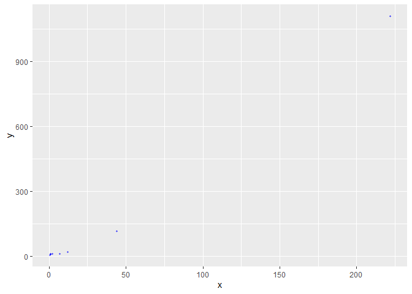

<!-- README.md is generated from README.Rmd. Please edit that file -->

# easyplotP

<!-- badges: start -->
<!-- badges: end -->

The goal of easyplotP is to create a simple scatter plot using a set of
numerical variables labelled x and y, to help visualize their
relationship. A blue scatter plot is generated using this function.

## Installation

You can install the development version of easyplotP using:
[GitHub](https://github.com/) with:

``` r
#install.packages("devtools")
devtools::install_github("stat545ubc-2023/easyplotP", ref = "0.1.0")
```

## Example

This is a basic example which shows you how to solve a common problem:

``` r
library("tidyverse")
#> Warning: package 'tidyverse' was built under R version 4.2.3
#> Warning: package 'ggplot2' was built under R version 4.2.3
#> Warning: package 'tibble' was built under R version 4.2.3
#> Warning: package 'tidyr' was built under R version 4.2.3
#> Warning: package 'readr' was built under R version 4.2.3
#> Warning: package 'purrr' was built under R version 4.2.3
#> Warning: package 'dplyr' was built under R version 4.2.3
#> Warning: package 'stringr' was built under R version 4.2.3
#> Warning: package 'forcats' was built under R version 4.2.3
#> Warning: package 'lubridate' was built under R version 4.2.3
#> ── Attaching core tidyverse packages ──────────────────────── tidyverse 2.0.0 ──
#> ✔ dplyr     1.1.3     ✔ readr     2.1.4
#> ✔ forcats   1.0.0     ✔ stringr   1.5.0
#> ✔ ggplot2   3.4.3     ✔ tibble    3.2.1
#> ✔ lubridate 1.9.2     ✔ tidyr     1.3.0
#> ✔ purrr     1.0.2     
#> ── Conflicts ────────────────────────────────────────── tidyverse_conflicts() ──
#> ✖ dplyr::filter() masks stats::filter()
#> ✖ dplyr::lag()    masks stats::lag()
#> ℹ Use the conflicted package (<http://conflicted.r-lib.org/>) to force all conflicts to become errors
library("ggplot2")
library("easyplotP")
#> Loading required package: datateachr
#> Loading required package: devtools
#> Warning: package 'devtools' was built under R version 4.2.3
#> Loading required package: usethis
#> Warning: package 'usethis' was built under R version 4.2.3
#> Loading required package: testthat
#> Warning: package 'testthat' was built under R version 4.2.3
#> 
#> Attaching package: 'testthat'
#> 
#> The following object is masked from 'package:devtools':
#> 
#>     test_file
#> 
#> The following object is masked from 'package:dplyr':
#> 
#>     matches
#> 
#> The following object is masked from 'package:purrr':
#> 
#>     is_null
#> 
#> The following objects are masked from 'package:readr':
#> 
#>     edition_get, local_edition
#> 
#> The following object is masked from 'package:tidyr':
#> 
#>     matches

data <- data.frame(A=c(0.4, 0.9, 1, 2, 7, 12, 44, 222), B=c(6, 8, 9, 10, 11, 18, 114, 1110))
easyplotP::easyplot(data$A, data$B)
```


